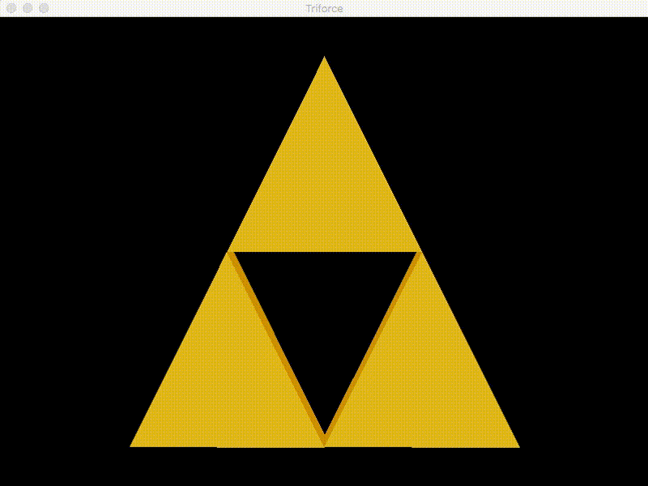

[](https://github.com/humbertodias/lwjgl-zelda-triforce/actions/workflows/cd.yml)


# Zelda Triforce with LWJGL

Simple Zelda Triforce animation with Java Binding for the LWJGL

### Prerequisites

1. Git 2.6+
2. Maven 3.6.3+
3. Java 8+

### How to Play

Clone

```shell
git clone https://github.com/humbertodias/lwjgl-zelda-triforce.git
cd zelda-triforce-lwjgl
```

Run

```shell
make package run
```

### Output


F = Full screen
W = Wireframe

### References

[https://www.lwjgl.org/guide](https://www.lwjgl.org/guide)
